# 🚖 RYDEX — Premium Full-Stack Vehicle Booking & Onboarding Platform

RYDEX is a premium, state-of-the-art ride-hailing and vehicle booking web application. Engineered as a MERN full-stack solution, it combines real-time driver matching, interactive mapping, custom partner onboarding workflows, secure video-based KYC, and instant socket-driven updates.

---

## 🚀 Key Features

### 👤 User Capabilities
- **Premium Landing Experience:** Immersive, high-performance landing page with clean layouts, dynamic visuals, and smooth hover animations.
- **Route Selection & Auto-Suggest:** Interactive address searching leveraging Geoapify Autocomplete with local mock fallback mapping Delhi/Mumbai landmarks.
- **Geospatial Driver Matching:** Finds and updates nearby drivers using Mongo `2dsphere` index queries for optimal booking matching.
- **Interactive Leaflet Maps:** Full map visuals showing pickup and dropoff coordinates and routing paths.
- **Real-Time Booking Status:** Socket.io notifications that update as the driver accepts, awaits payment, confirms, or starts the ride.
- **Flexible Payments:** Integration hooks for Razorpay checkout, supporting cash and online card/UPI workflows.

### 💼 Driver Partner Capabilities
- **Three-Step Onboarding Flow:** Complete validation wizard for vehicle registration, document uploads (Aadhaar, RC, License), and bank details.
- **Live Active Dashboard:** Statistics reporting earnings and online status toggle.
- **Pending Booking Requests:** Real-time requests queue with instant Accept/Reject actions.
- **ZegoCloud Video KYC:** Real-time, face-to-face secure room call setup with admin-level approval/rejection buttons for compliance checks.

---

## 🛠️ Technology Stack

| Layer | Technologies Used |
| :--- | :--- |
| **Frontend Framework** | Next.js (App Router, Server Actions, Dynamic API Routing) |
| **State Management** | Redux Toolkit (slice architecture) |
| **Real-time Server** | Node.js, Express, Socket.io (Identity management & room join) |
| **Styling & Animations** | TailwindCSS v4, Lucide React icons, Motion (Framer Motion) |
| **Database & ORM** | MongoDB, Mongoose (Geospatial `$near` & `$geometry` index queries) |
| **Maps & Locations** | Leaflet Map API, React Leaflet, Geoapify Geocoding API |
| **KYC & Payments** | ZegoCloud WebRTC Web UI UIKit, Razorpay Payments SDK |

---

## 📁 Repository Structure

```bash
├── images/                   # Generated high-quality feature screenshots
├── rydex/                    # Frontend client & backend API source code (Next.js)
│   ├── src/
│   │   ├── app/              # Next.js page routes (user, partner, admin, video-kyc)
│   │   ├── components/       # Reusable UI widgets & dashboards
│   │   ├── models/           # Mongoose schemas (User, Vehicle, Booking, Docs)
│   │   └── lib/              # DB connections and helper utilities
│   ├── create-user.js        # Seed user/partner credentials script
│   └── set-partner-live.js   # Elevated partner approval seeding script
└── socketServer/             # Real-time event gateway and in-memory Mongo launcher
    ├── models/               # User coordinates models
    ├── run-mongo.js          # In-memory MongoDB Server initialization script
    └── index.js              # Socket.io connection pool & endpoint broadcaster
```

---

## 📸 Visual Showcase & Feature Walkthrough

The interface is fully responsive, leveraging a sleek dark-themed design system. Below is a breakdown of the key pages captured during active feature testing:

| Feature / Screen | Screenshot | Description |
| :--- | :--- | :--- |
| **Public Landing Page** | 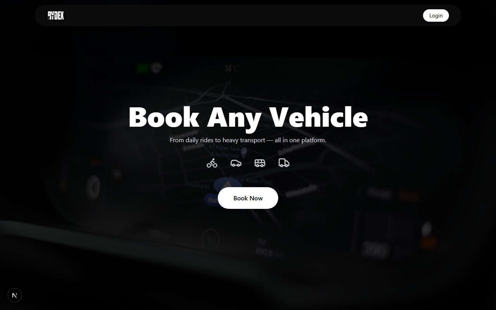 | Elegant public hero view with dark overlay background and immediate booking call-to-action. |
| **User Book Route** | 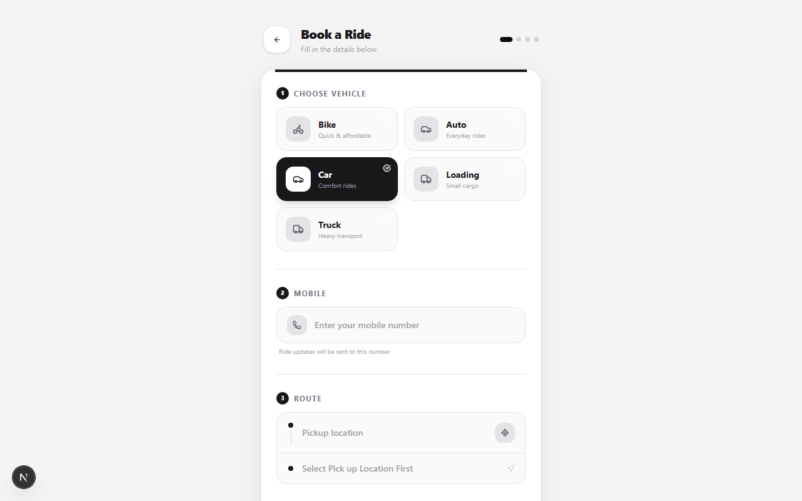 | Direct wizard to select vehicle types (Bike, Auto, Car, etc.), enter mobile numbers, and select routes with suggestions. |
| **Geospatial Search** | 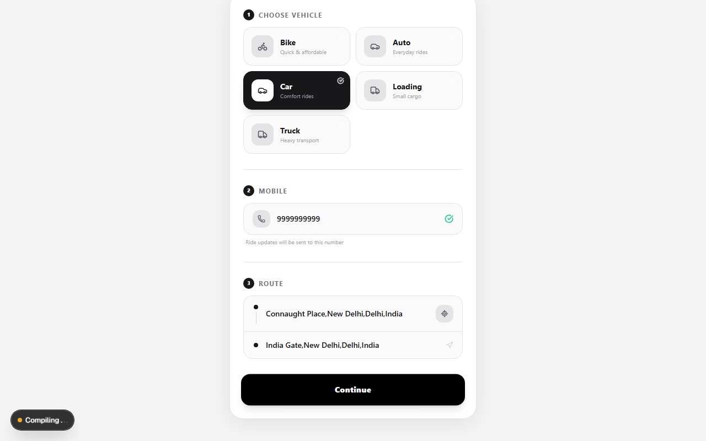 | Search view displaying available rides mapped in the radius of pickup using a Leaflet map. |
| **Checkout & Confirm** | 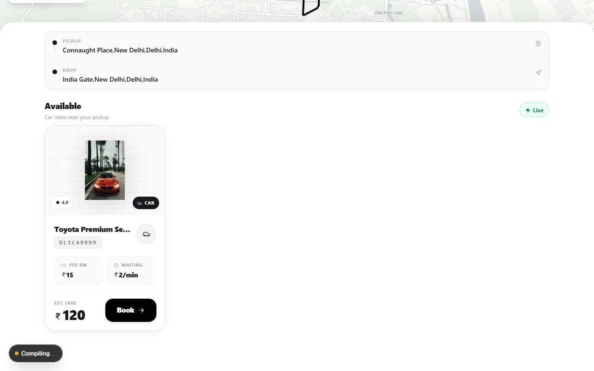 | Checkout view supporting cash or online payment method choices with real-time socket waiting status. |
| **My Bookings History** | 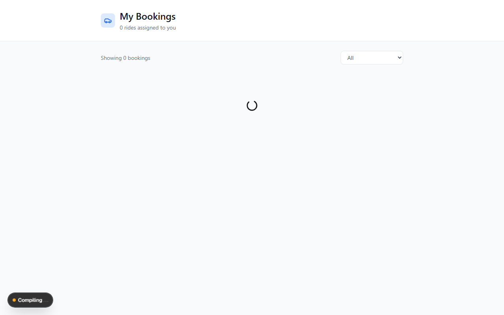 | Historical transactions log displaying status of booking receipts. |
| **KYC Verification** | 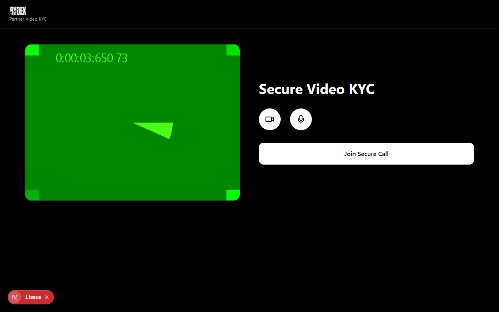 | Video room lobby checking micro and camera feeds before initializing live face-to-face verify calls. |
| **Onboarding - Vehicle** | 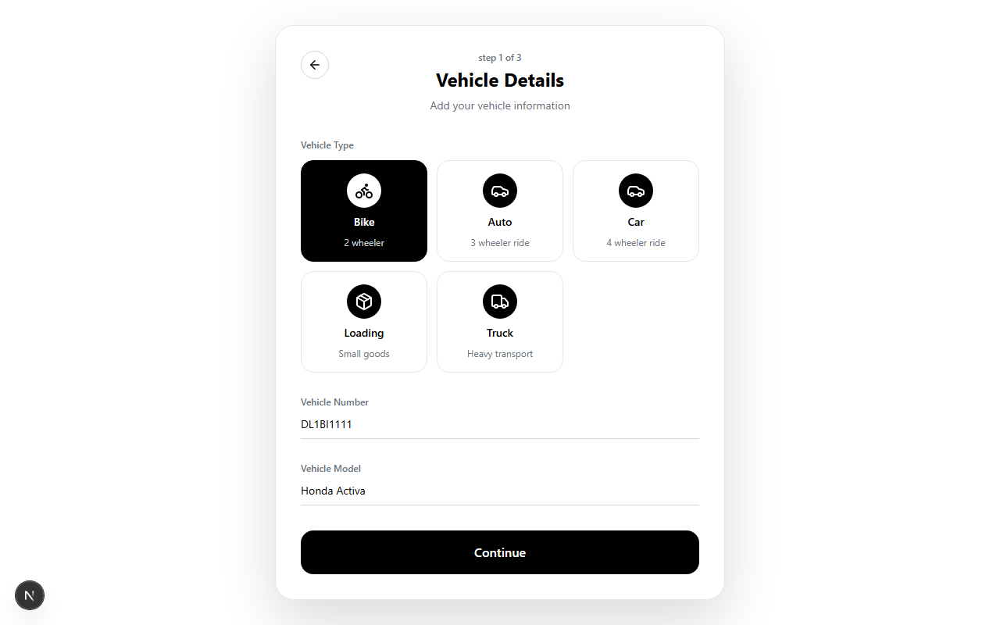 | First step of partner sign-up where vehicle type and model detail registration is completed. |
| **Onboarding - Documents** | 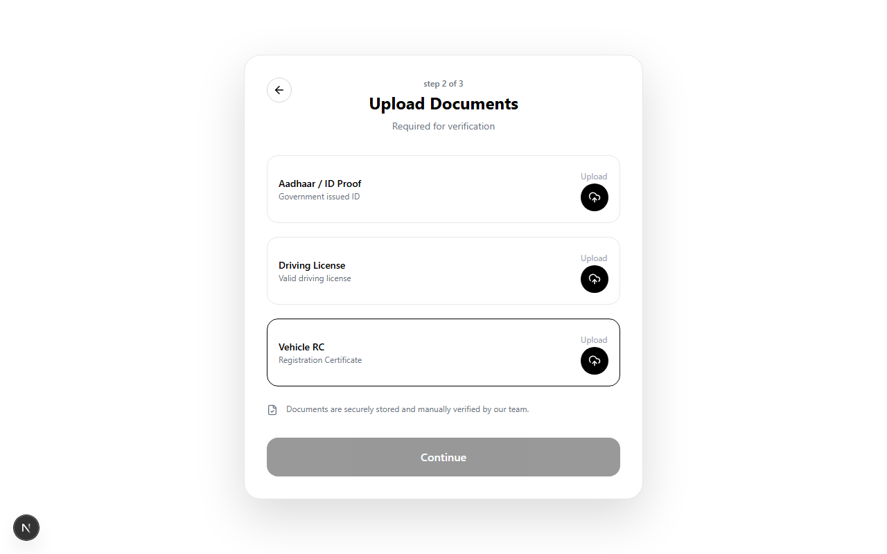 | Secure Aadhaar, License, and RC upload interface for driver authentication. |
| **Onboarding - Bank Info** | 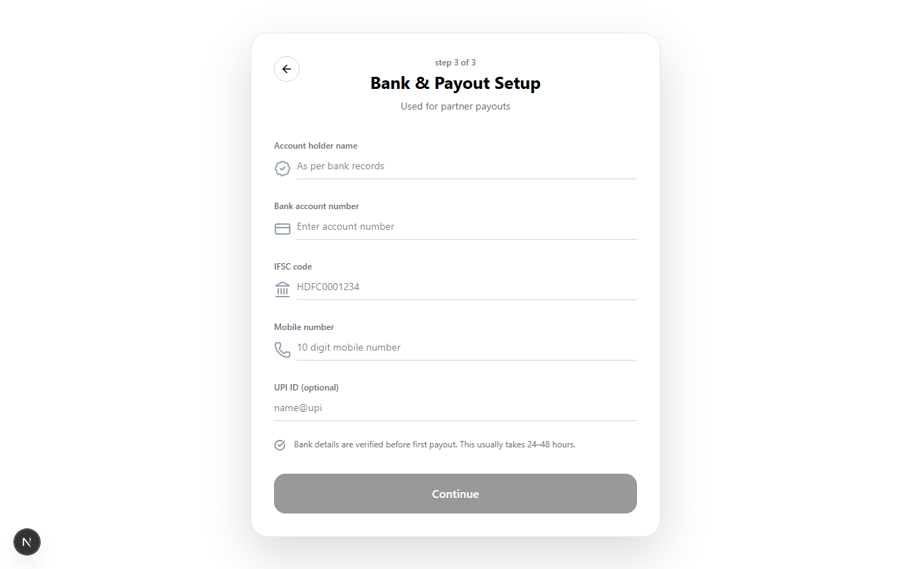 | Direct bank transfer and UPI detail integration setup form. |
| **Partner Requests** | 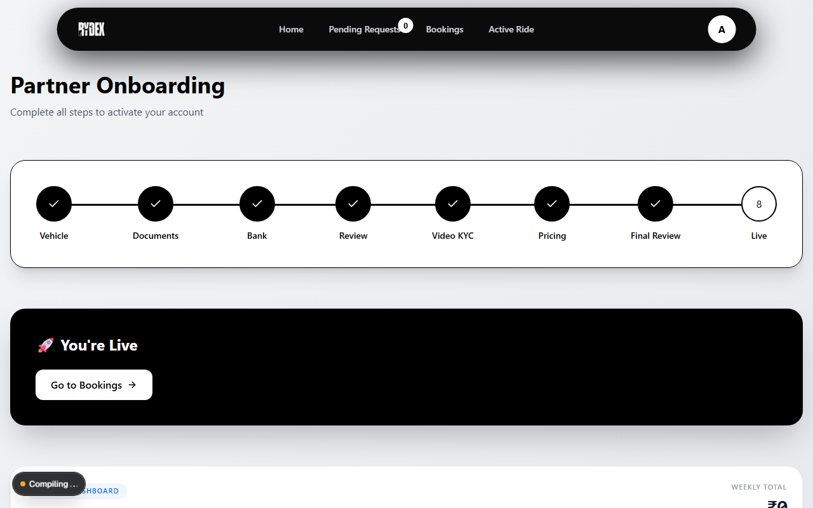 | Live driver view displaying real-time incoming booking cards with acceptance toggles. |
| **Partner Bookings** | 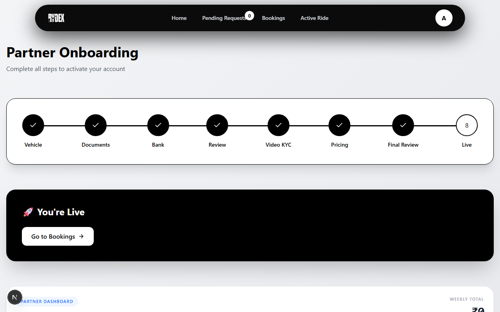 | Dashboard listing history of trips completed by the driver. |
| **Partner Active Ride** |  | Active job layout displaying current navigation target route details. |

---

## ⚙️ Local Development Setup

To launch and run the entire Rydex project locally, follow these steps:

### 1. Prerequisite Installations
Ensure you have **Node.js (v18+)** installed. In-memory MongoDB binaries are automatically fetched.

### 2. Start Database & Socket Gateway
Open a terminal in the `socketServer` directory:
```bash
# Install socket backend dependencies
npm install

# Start the In-Memory MongoDB Server (port 27017)
node run-mongo.js

# (In a separate terminal) Start the Socket.io Server (port 8000)
npm run dev
```

### 3. Setup Frontend & Seeding
Open a separate terminal inside the `rydex/rydex` directory:
```bash
# Install Next.js dependencies
npm install

# Run database seeds to create test profiles
node create-user.js        # Seed user: Amanv2225@gmail.com / Amanverma
node set-all-vehicles.js   # Installs available mock vehicles in the database
```

### 4. Start Next.js App
Inside `rydex/rydex`, start the development server:
```bash
npm run dev
```
The app will build and run on: **`http://localhost:3000`**

### 5. Utility Helper Scripts
We provide convenience scripts in the `rydex/rydex` folder to test different user states:
- `node create-user.js` - Resets/creates the default profile `Amanv2225@gmail.com` with password `Amanverma`.
- `node set-all-vehicles.js` - Approves all vehicle classes (Bike, Auto, Car, Loading, Truck) for testing.
- `node set-partner-live.js` - Elevates the test user directly to a live, approved partner status bypass (skips onboarding for easy dashboard testing).
- `node check-db.js` - Verifies Mongoose connection and tests nearby geospatial query status.
